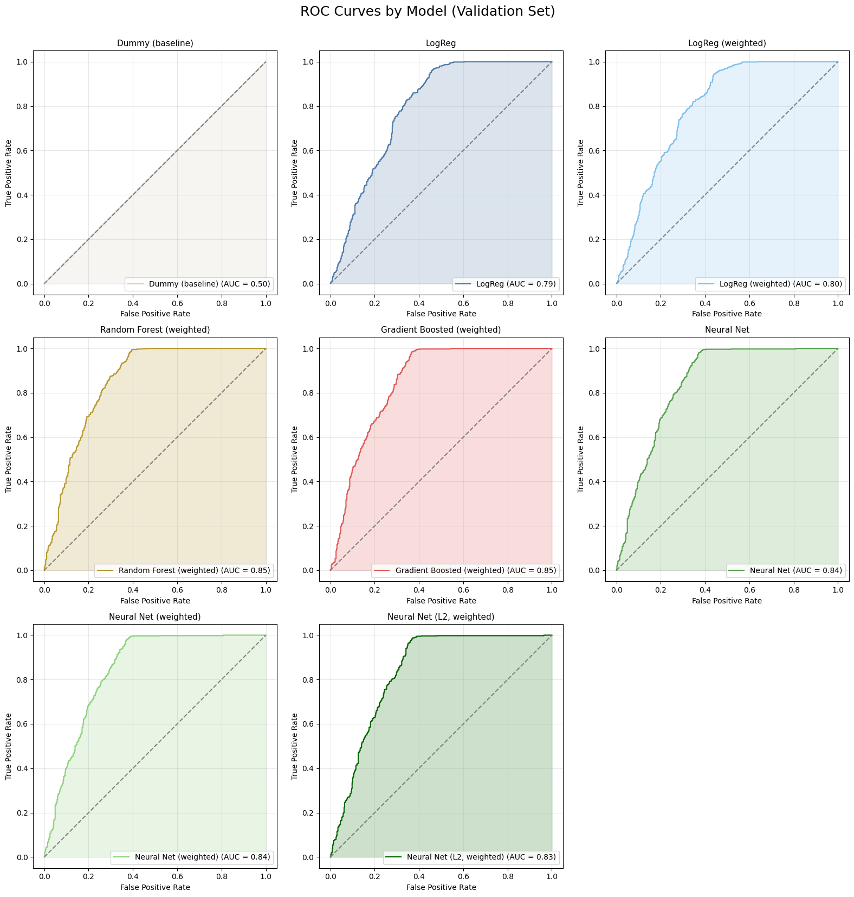

# Mikel Calderon – Data Science & AI Portfolio

**Data Scientist | UC Berkeley MIDS | Machine Learning • Data Viz • GenAI**

I build bridges between words and data.  
Over the past decade at Yahoo, I shaped knowledge graphs, curated high-stakes editorial content, and designed annotation frameworks that kept content consistent and trustworthy at a global scale. At UC Berkeley’s MIDS program, I’ve deepened that foundation with machine learning, data pipelines, and visualization. Most recently, I’ve explored Generative AI through prompt engineering, RAG prototypes, and connecting retrieval systems with editorial standards.

What ties it all together is a focus on **clarity, consistency, and impact**—whether I’m labeling short-form copy, evaluating model outputs, or training an ensemble classifier.

---

## Content Editorial | Yahoo

**Knowledge Graph Curation & Annotation**

- Curated and annotated entities for Yahoo’s multilingual knowledge graph, ensuring accuracy and consistency across athlete, politician, and public figure data quality.
- Followed editorial rules for terminology, formatting, and disambiguation (e.g., name variants, titles).
- Partnered with engineers to feed these annotations into data pipeline ingestion systems, improving relevance ranking and user experience.

**Tentpole Events (Olympics, Elections, World Cup)**

- Created and maintained structured bios and content metadata for high-visibility global events.
- Applied editorial standards at scale, balancing speed with precision under breaking news conditions.
- Collaborated cross-functionally to ensure consistency across teams and languages.

**Annotation & QA**

- Labeled and audited large datasets for ad and search quality, training contributors worldwide.
- Designed editorial guidelines and taxonomies that directly supported ML model evaluation and refinement.
- Conducted QA on annotations to ensure style, accuracy, and consistency with established standards.

---

## Analytics & Insights | Yahoo

**Contributor Query Analysis (Yahoo)**

- Analyzed millions of queries to surface seasonal trends and improve ad relevance models.
- Built dashboards in Google Sheets to communicate KPIs to product teams.
- Due to confidentiality, details are limited; this work involved **model A/B testing** for improving ad relevance.

---

## Machine Learning | UC Berkeley MIDS

**Repeat Customer Prediction Pipeline**

- Built end-to-end ML pipeline: data cleaning, feature engineering, model training, ensemble methods.
- Tools: Python, scikit-learn, Keras, Matplotlib.
- Results: Improved baseline DummyClassifier (~50%) to stacked ensemble (~75% validation accuracy).
- **Code:** [GitHub](https://github.com/mikelcal/w207-ml-project)

---

## Data Visualization | UC Berkeley MIDS

**CO Pollution Dashboard**

- Flask + D3.js dashboard with interactive choropleth maps and wind vector animations.
- Custom API endpoints for state averages and correlation analysis.
- Deployed on DigitalOcean for live access.
- **Live Demo:** https://co-dashboard.mikelcal.co/ • **Code:** [Github](https://github.com/mikelcal/co_dashboard)

**Tableau Public Scatter Plot**

- Visualizing international soccer athlete data, segmented by player height and nationality
- **Tableau Public:** [Player Data](https://public.tableau.com/views/Unit2-MikelCalderon/Sheet2?:language=en-US&:sid=&:redirect=auth&:display_count=n&:origin=viz_share_link)

**Model Performance Comparison**  
Visualization of ROC curves across multiple classifiers, comparing their ability to distinguish repeat vs. non-repeat customers.  

**Additional Visualizations**

- [Data Visualization Samples](dataviz_samples/)

---

## Generative AI | Workshops & Prototypes

**RAG with Redis (2025 Workshop)**

- Built a Retrieval-Augmented Generation (RAG) pipeline using Redis as a vector database.
- Indexed local documents, embedded text, and generated context-aware responses with citations.
- Experience covered ingestion, embedding, retrieval, and evaluation of outputs.
- Reinforces ability to connect editorial standards to GenAI outputs through retrieval pipelines.

---

📫 Reach me: [LinkedIn](https://linkedin.com/in/mikelcal) | [GitHub](https://github.com/mikelcal)
